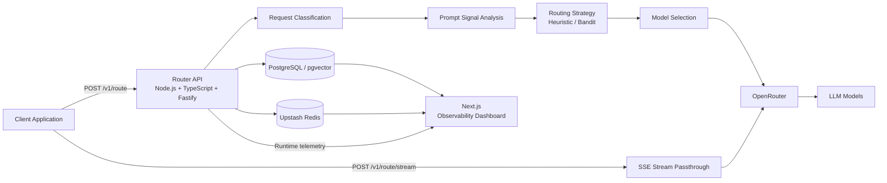

# ModelRouter

> An intelligent LLM routing and observability platform that classifies incoming prompts, selects the most appropriate model for each request using a benchmarked routing strategy, executes the request through a centralized Router API, and exposes runtime telemetry through a production dashboard.

[](https://modelrouter-api-m8gg.onrender.com)
[](https://modelrouter-dashboard.onrender.com/dashboard)
[](https://www.typescriptlang.org/)
[](https://nextjs.org/)
[](https://fastify.dev/)

---

## Overview

ModelRouter moves LLM model-selection logic out of individual applications and into a dedicated routing layer.

Instead of every client independently deciding which model to call, a client sends a prompt to one Router API. The Router classifies the request, selects a model using a benchmarked routing strategy, executes the call, and records what happened — so routing logic can evolve independently of any single application, and every decision stays auditable after the fact.

```text
             Client
               │
               │ POST /v1/route  or  POST /v1/route/stream
               ▼
┌─────────────────────────────── ┐
│          ModelRouter           │
│  Request Classification        │
│           ↓                    │
│  Prompt Signal Analysis        │
│  (length · complexity · steps) │
│           ↓                    │
│  Routing Strategy              │
│  (Heuristic / Bandit)          │
│           ↓                    │
│  Model Selection               │
│           ↓                    │
│  Provider Execution            │
│  (streaming or standard)       │
│           ↓                    │
│  Fallback + Telemetry          │
└────────────┬───────────────────┘
             ▼
        Model Provider
```

The system records every routing decision and runtime result, and exposes them through a separate observability dashboard.

### Why?

Different models trade off latency, capability, availability, and cost differently — and different *requests* need different things even within the same task category. A short bug-fix prompt and a multi-step refactor request may both be "code" tasks, but they don't deserve the same model.

ModelRouter provides a centralized decision layer, informed by prompt content rather than category alone, so routing quality can be measured, benchmarked, and improved over time rather than hardcoded once and left alone.

---

# Production

### Dashboard
https://modelrouter-dashboard.onrender.com/dashboard

### Router API
https://modelrouter-api-m8gg.onrender.com

### Health Check
```http
GET /health
```
Expected:
```json
{"status":"ok"}
```

The production deployment has been verified with a real `/v1/route` request, and the resulting event appeared in dashboard telemetry.

> The final production smoke test did not rerun the full 60-task benchmark.

---

# Features

## Intelligent Routing

Incoming prompts are classified before model selection, and routing decisions are informed by more than just task category.

Runtime telemetry records:

- task type
- prompt signals (length, estimated tokens, complexity score, multi-step detection)
- selected model
- routing strategy
- routing reason
- latency
- token usage
- cost
- fallback status
- classification source
- streaming vs. standard delivery

## Prompt-Based Routing Signals

Task classification alone treats every prompt in a category identically — a one-line bug fix and a multi-file refactor both classify as "code," but they don't warrant the same model.

Before model selection, the Router analyzes each prompt for:

| Signal | What it captures |
|---|---|
| **Prompt length** | Raw character count of the request |
| **Estimated tokens** | Rough token estimate (~4 characters/token) used as a proxy for request size |
| **Complexity score** | A 0–1 heuristic score derived from keyword signals (e.g. *refactor*, *architecture*, *optimize*), paragraph structure, and prompt length |
| **Multi-step detection** | Flags prompts containing numbered steps or sequential instructions (e.g. "first... then...") |

When a prompt's complexity score or estimated size crosses a threshold, the Router escalates to a higher quality-tier model within the same task category — rather than routing every "code" prompt to the same model regardless of how demanding it actually is. Every escalation decision is logged with a human-readable reason (e.g. *"complexity signal (score=0.75, ~420 tokens) escalated to higher-tier model"*), so routing behavior stays auditable rather than opaque.

This is a deliberately rule-based system, not a learned one — it's an explicit design choice favoring predictability and explainability over a black-box scoring model at this stage.

## Streaming (SSE)

The Router supports Server-Sent Events end to end: client → Router → provider → client, in addition to standard request/response.

```http
POST /v1/route/stream
```

Rather than waiting for a full model response before replying, the Router opens a streaming connection to the provider and forwards tokens to the client as they arrive — the same interaction pattern used by production chat products, and a meaningfully harder engineering problem than the request/response happy path, since a live stream is proxied through two hops rather than one.

Streamed requests are still logged after the stream completes, with accumulated response text, latency, and routing metadata recorded identically to standard requests.

## Routing Strategies

### Heuristic
A deterministic, classification-and-signal-based routing strategy used for immediate model-selection decisions. Serves as both the baseline strategy and the safe fallback when the learned strategy lacks sufficient data.

### Bandit
A learning-oriented (epsilon-greedy contextual bandit) strategy that uses accumulated routing history — real outcomes from real requests — to improve model-selection decisions over time. Mostly exploits the historically best-performing model for a given task type, while continuing to explore alternatives some percentage of the time to keep performance data fresh. Falls back to the Heuristic strategy when insufficient historical data exists for a given task type.

## Fallback Handling

The Router records whether a response was produced through a fallback path, so reliability behavior is visible in telemetry rather than hidden:

```json
{
  "wasFallback": false
}
```

## Runtime Observability

The dashboard exposes:

- total requests
- success/failure rate
- average latency
- quality information
- benchmark quality
- model request distribution
- routing failures
- recent routing activity
- selected model
- routing reason
- request latency
- cost

## Persistent Infrastructure

- PostgreSQL / pgvector
- Upstash Redis
- OpenRouter

---

# Architecture



---

# Request Lifecycle

```text
Client Request
      │
      ▼
Request Validation
      │
      ▼
Prompt Classification
      │
      ▼
Prompt Signal Analysis
(length · tokens · complexity · multi-step)
      │
      ▼
Routing Strategy
      │
      ▼
Model Selection
      │
      ▼
Provider Execution ──────► Streaming (SSE) or Standard
      │
      ├── Success ───────► Response
      │
      └── Failure ───────► Fallback
                               │
                               ▼
                            Response
      │
      ▼
Telemetry Recording
      │
      ▼
Dashboard
```

---

# API

## `POST /v1/route`

Production:
```text
https://modelrouter-api-m8gg.onrender.com/v1/route
```

### Headers
```http
Content-Type: application/json
```

No client-side OpenRouter authorization header is required. The deployed Router uses its server-side provider credential.

Optional:
```http
x-routing-strategy: bandit
```

### Request
```json
{
  "prompt": "Explain the difference between TCP and UDP in one sentence."
}
```

### Response
```json
{
  "text": "TCP is connection-oriented, while UDP is connectionless...",
  "tokensIn": 12,
  "tokensOut": 80,
  "costUsd": 0,
  "latencyMs": 1234,
  "modelUsed": "openai/gpt-oss-20b:free",
  "wasFallback": false,
  "classificationSource": "heuristic",
  "promptSignals": {
    "promptLength": 62,
    "estimatedTokens": 16,
    "complexityScore": 0.0,
    "isLikelyMultiStep": false
  }
}
```

Exact text, model, latency, token counts, cost, and signal values vary by request.

Cached responses may additionally contain:
```json
{
  "cached": "exact"
}
```

---

## `POST /v1/route/stream`

Production:
```text
https://modelrouter-api-m8gg.onrender.com/v1/route/stream
```

Streams the model response as Server-Sent Events instead of waiting for the full response body. Routing (classification, signal analysis, model selection) happens before the stream opens; the client then receives tokens incrementally as the provider generates them.

### Headers
```http
Content-Type: application/json
```

### Request
```json
{
  "prompt": "Count from 1 to 10, explaining each number briefly."
}
```

### Response
`Content-Type: text/event-stream` — a sequence of `data: {...}` events forwarded live from the provider, terminated when the stream closes. The full response is reconstructed and logged to telemetry after the stream ends, alongside the same routing metadata recorded for standard requests.

---

# cURL

```bash
curl -X POST "https://modelrouter-api-m8gg.onrender.com/v1/route" \
  -H "Content-Type: application/json" \
  -d '{
    "prompt": "Explain the difference between TCP and UDP in one sentence."
  }'
```

Streaming:
```bash
curl -N -X POST "https://modelrouter-api-m8gg.onrender.com/v1/route/stream" \
  -H "Content-Type: application/json" \
  -d '{
    "prompt": "Count from 1 to 10, explaining each number briefly."
  }'
```

# PowerShell

```powershell
$body = @{
    prompt = "Explain the difference between TCP and UDP in one sentence."
} | ConvertTo-Json

Invoke-RestMethod `
    -Uri "https://modelrouter-api-m8gg.onrender.com/v1/route" `
    -Method POST `
    -ContentType "application/json" `
    -Body $body
```

# Postman

```text
Method: POST
URL: https://modelrouter-api-m8gg.onrender.com/v1/route
```

Header:
```text
Content-Type: application/json
```

Body → raw → JSON:
```json
{
  "prompt": "Explain the difference between TCP and UDP in one sentence."
}
```

After sending the request, open the production dashboard and verify the request under **Recorded Routing Activity**.

---

# Dashboard

The dashboard is a dedicated observability surface for the Router.

### Overview
Provides:
- total requests
- successful requests
- failure rate
- average latency
- quality scoring availability
- benchmark quality
- active model distribution
- routing failures
- recent routing activity

### Routing
Shows how requests are distributed, why a model was selected, and which prompt signals influenced the decision.

### Models
Provides visibility into active/observed models and request distribution.

### Cache
Provides visibility into cache-related runtime behavior.

### Budgets
Provides a dedicated surface for budget-related operational information.

### Evaluation
Exposes benchmark-related information.

The project contains a **60-task evaluation benchmark** used to evaluate routing behavior across three strategies — always-cheapest, always-frontier, and the Router's own heuristic/bandit strategies — measured on cost, latency, and quality. The benchmark remains separate from normal runtime traffic.

### Settings / Status
Provides operational status information for the deployed system, including:
- Router API
- Upstash Redis
- PostgreSQL / pgvector

---

# Screenshots


---

# Technology Stack

| Layer | Technology |
|---|---|
| Router | Node.js, TypeScript, Fastify |
| Dashboard | Next.js, React, TypeScript |
| Styling | Tailwind CSS |
| Icons | Lucide React |
| LLM Provider | OpenRouter |
| Cache | Upstash Redis |
| Database | PostgreSQL / pgvector |
| Deployment | Render |
| Source Control | GitHub |
| Validation | TypeScript, ESLint, production builds |

---

# Repository Structure

```text
ModelRouter/
├── router/
│   ├── src/
│   │   ├── routes/
│   │   │   ├── route.ts           # standard request/response
│   │   │   └── routeStream.ts     # SSE streaming passthrough
│   │   ├── routing/
│   │   │   ├── classify.ts
│   │   │   ├── promptSignals.ts   # length / complexity / multi-step analysis
│   │   │   ├── heuristicRouter.ts
│   │   │   ├── banditRouter.ts
│   │   │   └── performanceTracker.ts
│   │   ├── providers/
│   │   ├── models/
│   │   ├── cache/
│   │   ├── budget/
│   │   ├── db/
│   │   └── server.ts
│   ├── package.json
│   ├── tsconfig.json
│   └── .env.example
│
├── dashboard/
│   ├── app/
│   ├── components/
│   ├── package.json
│   └── .eslintrc.json
│
├── evals/
│   ├── datasets/
│   ├── scoring/
│   ├── run.ts
│   └── report.ts
│
└── README.md
```

---

# Local Development

## Prerequisites
- Node.js
- npm
- Git
- OpenRouter credentials
- PostgreSQL
- Upstash Redis

## Clone
```bash
git clone https://github.com/soumik03/ModelRouter.git
cd ModelRouter
```

## Router
```bash
cd router
npm install
npm run build
npm run start
```
The Router uses the runtime `PORT` and binds to `0.0.0.0` for deployment compatibility.

## Dashboard
```bash
cd dashboard
npm install
npm run build
npm start
```
Set:
```env
ROUTER_API_URL=http://localhost:<router-port>
```

---

# Environment Variables

Never commit secrets.

### Router
```env
OPENROUTER_API_KEY=your_openrouter_key
DATABASE_URL=your_database_url
UPSTASH_REDIS_REST_URL=your_redis_url
UPSTASH_REDIS_REST_TOKEN=your_redis_token
PORT=3000
```

### Dashboard
```env
ROUTER_API_URL=http://localhost:<router-port>
```

In production, `ROUTER_API_URL` points to the deployed Render Router service.

---

# Production Deployment

The application is deployed as two independent Render services.

## Router
```text
Root Directory: router
Build: npm run build
Start: npm run start
```
Required production environment variables:
```env
DATABASE_URL=...
UPSTASH_REDIS_REST_URL=...
UPSTASH_REDIS_REST_TOKEN=...
OPENROUTER_API_KEY=...
```

## Dashboard
```text
Root Directory: dashboard
Build: npm ci && npm run build
Start: npm start
```
Required:
```env
ROUTER_API_URL=https://<router-service>.onrender.com
```

The dashboard production build clears the previous `.next` output before generating a fresh artifact to avoid stale Next.js chunks.

---

# Production Verification

The final deployment was verified at multiple levels.

### Router
- TypeScript compilation — passed
- Production build — passed
- Production start — passed
- `/health` — HTTP 200
- Real `/v1/route` request — passed
- Real `/v1/route/stream` request — passed, tokens observed arriving incrementally

### Dashboard
- TypeScript — passed
- ESLint — passed
- Production build — passed
- Production deployment — live
- JavaScript assets — loading correctly
- Dashboard pages — accessible

### Integration
- Dashboard → Router — healthy
- Router → Redis — connected
- Router → PostgreSQL / pgvector — connected
- Runtime routing events — visible
- Real production request — reflected in telemetry

### Evaluation
- Existing 60-task benchmark preserved
- Benchmark files unchanged
- Full benchmark intentionally not rerun during final production verification

---

# Engineering Challenges

## Streaming Through a Proxy Layer
Supporting SSE end to end required forwarding a live upstream stream through the Router rather than buffering the full response before replying — a materially different code path from standard request/response, including handling partial chunks, stream termination, and logging telemetry only after the stream completes rather than at request time.

## Routing on More Than Category
Task classification alone treats all same-category prompts identically. Prompt-signal analysis (length, estimated tokens, a keyword/structure-based complexity score, and multi-step detection) was added as a deliberately simple, explainable layer on top of classification — favoring transparent heuristics over an opaque scoring model, with every escalation decision logged with a human-readable reason.

## Production Port Handling
The Router uses the deployment-provided `PORT` and binds to `0.0.0.0`, allowing it to run correctly inside Render.

## Independent Service Deployment
The Router and Dashboard are independently deployable:
```text
Render
├── Router API
└── Dashboard
```
The dashboard communicates with the Router using `ROUTER_API_URL`.

## Next.js Production Artifact Consistency
The dashboard build clears the existing `.next` directory before building:
```bash
node -e "require('fs').rmSync('.next', { recursive: true, force: true })" && next build
```
This prevents stale static chunks from being served with a newly generated HTML artifact.

## Runtime Observability
The system records actual routing decisions and runtime results, including which prompt signals influenced a decision, allowing production behavior to be inspected after real requests rather than relying only on static configuration.

---

# Design Principles

### Separation of Concerns
Routing, provider execution, persistence, caching, and observability are separated into clear responsibilities.

### Centralized Model Selection
Client applications do not need to duplicate routing rules.

### Decisions Informed by Content, Not Just Category
Task type alone is a coarse signal. Prompt length, complexity, and structure refine model selection within a category rather than treating every request in that category identically.

### Observable Decisions
Every routing system needs visibility into both the decision and its result. ModelRouter records routing context — classification, signals, strategy, and reason — alongside runtime metrics.

### Provider Abstraction
The Router provides a boundary between applications and the underlying model provider, whether the response is streamed or returned in full.

### Production-First Validation
The project is validated through:
```text
TypeScript
   ↓
Lint
   ↓
Production Build
   ↓
Production Start
   ↓
Health Check
   ↓
Real API Request (standard + streaming)
   ↓
Dashboard Telemetry
```

---

# Security

Secrets are stored in deployment environment variables.

The client does not receive the provider API key.

Never place credentials in:
- source code
- README files
- screenshots
- frontend-exposed environment variables
- Git history

Rotate credentials immediately if they are accidentally exposed.

---

# Performance Notes

Production latency is workload-dependent.

The Router communicates with external model infrastructure, so model inference latency can dominate end-to-end response time. Streaming reduces perceived latency for the client even when total generation time is unchanged, since output begins arriving before the full response is complete.

Render free instances can also sleep after inactivity, which may introduce cold-start delays.

Therefore, dashboard latency should be interpreted as observed end-to-end runtime behavior under the current deployment and provider configuration.

---

# Future Improvements

Potential extensions include:
- stronger quality scoring
- cost-aware routing
- latency-aware routing
- richer contextual bandit policies
- provider health scoring
- model availability detection
- client authentication/API keys
- rate limiting
- distributed tracing
- alerting
- historical analytics
- automated benchmark comparisons
- configurable routing policies
- A/B routing mode with live comparative stats across strategies

These are future directions, not claims about the current implementation.

---

# Project Status

**Production deployed and verified.**

```text
Router API          ✅ Live
Streaming (SSE)      ✅ Verified
Prompt Signals       ✅ Verified
Dashboard            ✅ Live
Health Check         ✅ Passing
Real Routing         ✅ Verified
Runtime Telemetry    ✅ Verified
Redis                ✅ Connected
PostgreSQL           ✅ Connected
Production Build     ✅ Passing
Lint                 ✅ Passing
Benchmark            ✅ Preserved
```

---

# Author

**Soumik Talukder**

GitHub: https://github.com/soumik03
LinkedIn: https://linkedin.com/in/soumiktalukder

---

> ModelRouter is an engineering project focused on intelligent LLM routing, model selection, production infrastructure, and observability.
